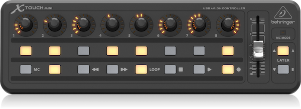
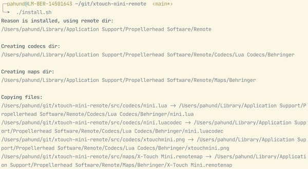
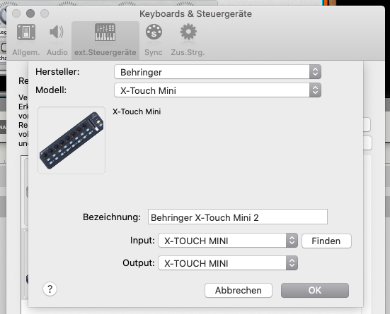
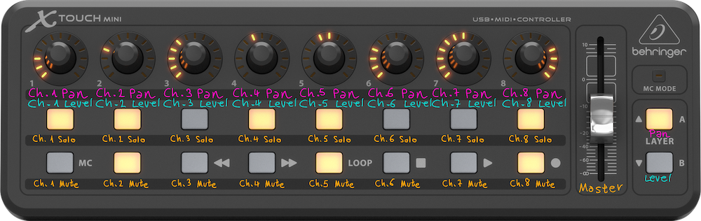
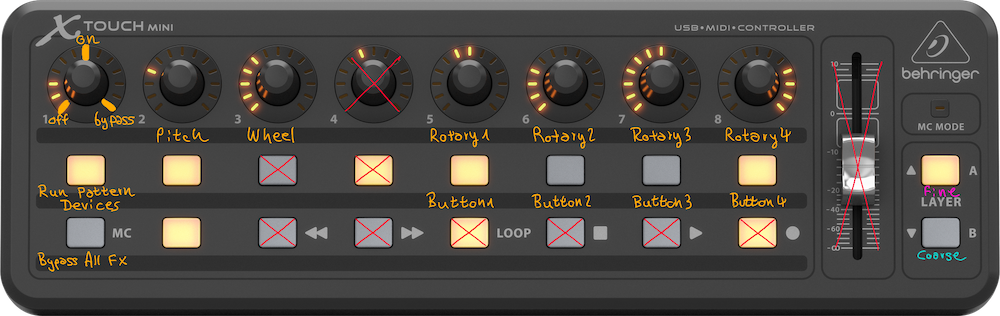
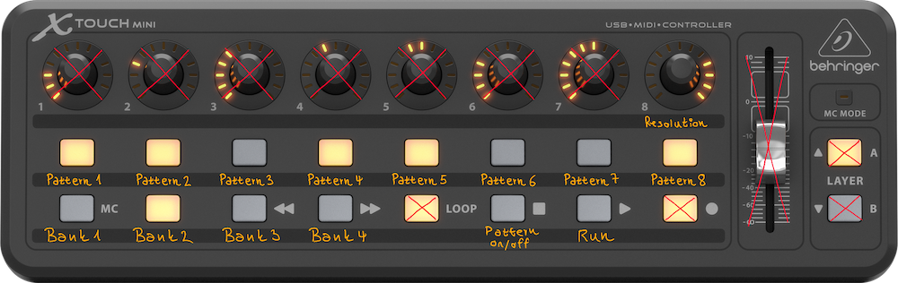

# X-Touch Mini Remote

Remote map and Lua codecs for using
the [Behringer X-Touch Mini](https://www.behringer.com/product.html?modelCode=P0B3M) MIDI controller with
the [Reason](https://www.reasonstudios.com/reason) digital audio workstation (DAW).



Based on the work of **Gulli Johansen**, who published the original Lua files and remote map in this project
on [reasontalk.com](https://forum.reasontalk.com/viewtopic.php?t=7514815) in November 2019.

## Installation

Download the most recent version here: 

* [Version 4.0.0](https://github.com/zapperment/xtouch-mini-remote/archive/v4.0.0.zip)

To use the remote map and codecs in Reason, run the [install.sh](install.sh) script on the command line:



This will copy the remote map and codec files over to the appropriate locations on your local file system so that
Reason can use them.

⚠️ **Please note:** The script only works on macOS. On Windows, copy the files over manually. Refer to
the [original post by Gulli on reasontalk.com](https://forum.reasontalk.com/viewtopic.php?t=7514815) for details.

After successful installation, restart Reason and select the Behringer X-Touch Mini control surface:

* Preferences → Control Surfaces → Add manually → Manufacturer: Behringer → Model: X-Touch Mini

Use the MIDI in and out ports provided by the X-Touch Mini.



## Supported Devices

The [current version 2.0.0](https://github.com/zapperment/xtouch-mini-remote/releases/tag/v2.0.0) supports the
following devices and rack extensions.

### Main Mixer



The rotary knobs control either the pan of mixer channels 1-8, or the level, depending on which layer you select.

The two rows of buttons are used for soloing and muting mixer channels 1-8.

### Combinator



The rotaries on the Combinator 1-4 are controlled with the rotary knobs 5-8 on the X-Touch Mini.

The rotary knobs have two resolution modes, “coarse” and “fine”, which you can switch with the layer buttons.

### Matrix



Use the X-Touch Mini buttons to select patterns and banks, to turn the pattern section on or off, and to run the
sequencer.

Rotary knob 8 controls the pattern resolution.

## Creating Your Own Mappings

To create your own mapping file or add new devices to the existing file, first and foremost it is important to
know what each of the controls on the X-Touch Mini are called in the mappings.


* The encoder knobs are named `Rotary 1`, `Rotary 2`, (…) `Rotary 8` (MIDI events generated when you twist one of
  the encoders)
* The encoder buttons are named `Rotary Button 1`, `Rotary Button 2`, (…) `Rotary Button 8` (MIDI events
  generated when you press down on one of the encoders)
* The upper row buttons are named `Button 1`, `Button 2`, (…) `Button 8`
* The lower row buttons are named:
    * `Left Button`
    * `Right Button`
    * `Rewind Button`
    * `Fast Fwd Button`
    * `Loop Button`
    * `Stop Button`
    * `Play Button`
    * `Record Button`
* The master fader is (surprisingly) named `Master Fader`
* The buttons for selecting layers are named `Layer A Button` and `Layer B Button`

Take a look at how the existing mapping file is set up:

- [X-Touch Mini.remotemap](src/main/maps/X-Touch%20Mini.remotemap)

The documentation by Reason Studios about the mapping file format is also included in this repository:

- [Remote Codec Developer.pdf](resources/docs/Remote%20Codec%20Developer.pdf)

**Pull requests are welcome!**

## Alternative Codec and Mapping

The original mapping and coded by Gulli Johansen, published
on [reasontalk.com](https://forum.reasontalk.com/viewtopic.php?t=7514815) in November 2019 are also included in
this project.

### Installation

To use the remote map and codecs by Gully Johansen in Reason, run the [install.sh](install.sh) script on the
command line, with the parameter `johansen`:

```shell
./install.sh johansen
```

### Reason Studios Devices and Rack Extensions

The `johansen` mapping supports the following devices and rack extensions by Reason Studios:

- Reason Studios Combinator
- Reason Studios Acoustic Guitarist
- Reason Studios Radical Piano
- Reason Studios Polar
- Reason Studios Scream 4 Distortion
- Reason Studios Channel Dynamics
- Reason Studios Channel EQ
- Reason Studios Master Compressor
- Reason Studios A List Studio Drummer
- Reason Studios Audiomatic
- Reason Studios RV7000 Advanced Reverb
- Reason Studios MClass Equalizer
- Reason Studios MClass Compressor
- Reason Studios MClass Maximizer
- Reason Studios MClass Stereo Imager
- Reason Studios Pulsar
- Reason Studios Line Mixer 6:2
- Reason Studios RV-7 Digital Reverb
- Reason Studios DDL-1 Digital Delay Line
- Reason Studios D-11 Foldback Distortion
- Reason Studios ECF-42 Envelope Controlled Filter
- Reason Studios CF-101 Chorus/Flanger
- Reason Studios PH-90 Phaser
- Reason Studios UN-16 Unison
- Reason Studios COMP-01 Compressor/Limiter
- Reason Studios PEQ-2 Two Band Parametric EQ

### Third-party Rack Extensions

The `johansen` mapping supports the following rack extensions by third-party developers:

- Kuassa EVE AT1
- Kuassa EVE AT4
- Kuassa EVE MP5
- Kuassa Efektor Silencer
- Kuassa Kratos 2 Maximizer
- Kuassa Efektor CP3603
- Kuassa Efektor CH3604
- Kuassa Efektor DS3603
- Kuassa Efektor FZ3603
- Kuassa Efektor OD3603
- Kuassa Delay Efektor DL3606
- Kuassa Amplifikation Vermilion
- Kuassa Amplifikation Creme
- Kuassa Amplifikation Caliburn
- Kuassa Amplifikation Matchlock
- Kuassa Cerberus Bass Amp
- kiloHearts 3BandEQ
- kiloHearts Chorus
- kiloHearts Delay
- kiloHearts Gain
- kiloHearts Limiter
- kiloHearts Reverser
- kiloHearts Stereo
- kiloHearts TransientShaper
- Synapse Audio Software Chorus
- Synapse Audio Software Filter
- Synapse Audio Software Phaser
- Synapse Audio Software Reverb
- Synapse Audio Software Ring Modulation
- Synapse Audio Software Vintage EQ
- Synapse Audio GQ7
- Synapse Audio Ninety
- Softube TubeTechCC
- Softube Reason Bass Amp
- Softube Reason Amp
- Softube FET Compressor
- Softube Dynamite(Valley People
- Softube Tridemt A-Range EQ
- Softube Saturation Knob
- Flower Audio Loudness Meter
- Selig Audi Leveler
- Selig Audio Gain
- Selig Audio DeEsser
- Quadelectra StereoSplitter
- Ochen K Carve EQ Ducker
- iZotope Inc Ozone Maximizer
- pongasoft ABSwitch
- Unfiltered Audio G8 Dynamic Gate
- Unfiltered Audio Yoko Band-Spliter
- ThatMusicCompany T2 Phaser
- ThatMusicCompany Distort Chain
- ThatMusicCompany Mr Over Drive
- MSDSP Moo Tube Compresso
- McDSP Moo Q Equalizer
- McDSP C670 Compressor
- McDSP E670 Equalizer
- McDSP FRG-EEE Equalizer
- McDSP FRG-4RE Compressor
- Bassment DSP SA16 Chorus
- DLD Technology Revolution
- Devoloop DYNARAGE
- Rob Papen RPSpec
- Cakewalk RE2A
- fxpansion DCAM Envolute Shaper
- Reasonistas CORE
- fxpansion DCAM Bus COmpresser
- LAB ONE Buttonings ReQ 131
- Audiorealism Abl2
- Audiorealism ReDominator
- IOx Audioware Titan 410x Precision Maximizer
- IOx Audioware Onyx Onyx 430i Tube Limiter
- Red Rock Sound Multi Band Compressor
- Red Rock Sound Multi Band Limiter
- Red Rock Sound C1-Alpha
- Red Rock Sound C1L1
- Red Rock Sound C1-Sigma
- Red Rock Sound Re 60 Spectrum Analyzer
- Red Rock Sound Re 202
- Red Rock Sound Re 200
- Red Rock Sound Re 302
- Red Rock Sound. Orchesteral Hall Reverb

